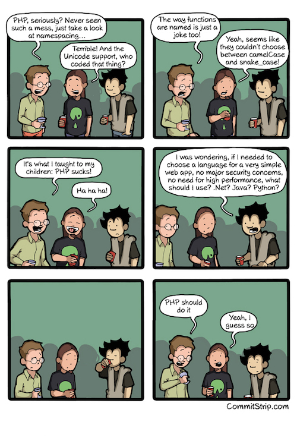
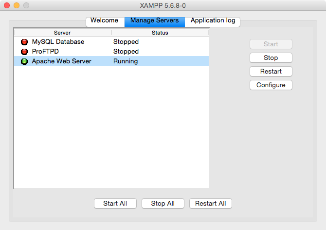

# PHP Intro

## Learning Objectives

- Start Apache running locally on your computer.
- Write a PHP function that contains variables.

## What is PHP, and why does everyone "hate" it?

PHP originally stood for Personal Home Page... because it was created by some guy to use just on his personal home page. He had no intention of creating a programming language.

However, nothing like it really existed, so other people caught wind of what he was using and started adding their own functionalities to it.

Thus, PHP evolved organically. And as a result, it's kind of a mess.

PHP is very procedural. It doesn't really have objects*. Instead of giving you an Array object that has methods attached to it, it just gives you 53 functions with "array" in the name. There are 9500 total built-in functions, all in the global namespace. - http://php.net/manual/en/function.array.php

> It does have objects now, actually. But instead of doing something like `artist.name` it's `$artist->name`, which is much less enjoyable to write.

### At the same time...

There are several reasons to like PHP:

1. It's super-easy to pick up. It looks a lot like Javascript, and because you're dealing with functions instead of objects, it's easier to read.

2. It's *everywhere*. It had a massive head start.

3. It's easy to embed in HTML. PHP works just like `.html.erb` or `.hbs` files, and you don't need to do anything fancy for that to work.

4. It makes a lot of back-end concepts easy to understand. Look at the `$_SERVER` variables:

    ```PHP
    <!DOCTYPE html>
    <html>
      <head>
        <title>Hello</title>
      </head>
      <body>

        <pre><?php print_r($GLOBALS); ?></pre>

      </body>
    </html>
    ```

Now we can easily see all of the information we're getting from the server, as well as all of the GET and POST parameters, cookies, etc.

### I use PHP...

...for rapid prototyping. When I want to quickly make a script that involves reading/writing files, PHP is my go-to.

For example, my [PHP Computer Navigator](https://github.com/RobertAKARobin/PHP-Computer-Navigator) is extremely useful to me. I use it to navigate around all my various repos and code projects.



## Install PHP

> Note: I personally don't use XAMPP to run Apache. I used to for years, but now I do it through the command line. We're not because the configuration varies from computer to computer.

Download XAMPP:

https://www.apachefriends.org/index.html

This is basically like the Blue Elephant for Postgres, except for running the server for PHP, called Apache. (It can also do MySQL and some other stuff.)

Open it, and make sure Apache is running:



## Your first PHP file

XAMPP stores everything in:

```
/Applications/XAMPP/xamppfiles/htdocs
```

Give the `htdocs` folder the proper permissions:
1. Click on `htdocs`
- Select `File>Get Info` (Command + I)
- At the bottom, click the little padlock and enter your password
- Select "Read & Write" as the Privilege in each row
- Click the little gear at the bottom and select "Apply to enclosed items..."

Now, create a new file called `hello.php`. Inside, write this:

```PHP
<?php

function quiznosToaster($tray){
  echo("I'm giving off heat... ");
  return("$tray is now toasty!");
}

$sandwich = "BLT";
echo(quiznosToaster($sandwich));

?>
```

Then, go to `localhost/hello.php`.

## Big differences between PHP and Javascript

- To add strings together you use `.`, not `+`, but you still use `+` to add numbers.
- There's no `var`. Instead, variables all begin with `$`. So instead of `var artist = ` you have `$artist =`.
- PHP has classes. Instead of referencing a property or method with `.` (`artist.name`) you use `->` (`$artist->name`).
- Every PHP snippet begins with `<?php` and ends with `?>`.

## Try this:

```PHP
<!DOCTYPE html>
<html>
  <head>
    <title>Hello</title>
  </head>
  <body>

  <?php
    $adjectives = array("attractive", "terrible", "sad", "lugubrious");
    $randomIndex= array_rand($adjectives, 1);
    $adjective = $adjectives[$randomIndex];
  ?>
    <h1><?php echo("My, you're looking $adjective today!"); ?></h1>

  </body>
</html>
```

# [FizzBuzz in PHP](https://github.com/ga-wdi-exercises/php-fizzbuzz)

# [Phpone Book](https://github.com/ga-wdi-exercises/phpone_book)

Deployed version: http://phponebook.herokuapp.com/

## Congrats! You now know how to:

- Write functions
- Define variables
- Save to a file
- Read a file
- Loop
- Turn JSON into an array / object, and vice-versa
- Respond to HTTP requests

## Hungry for more PHP?

- http://www.phptherightway.com/
- http://www.slimframework.com/
- https://laravel.com/
- http://php.net/manual/en/internals2.php
